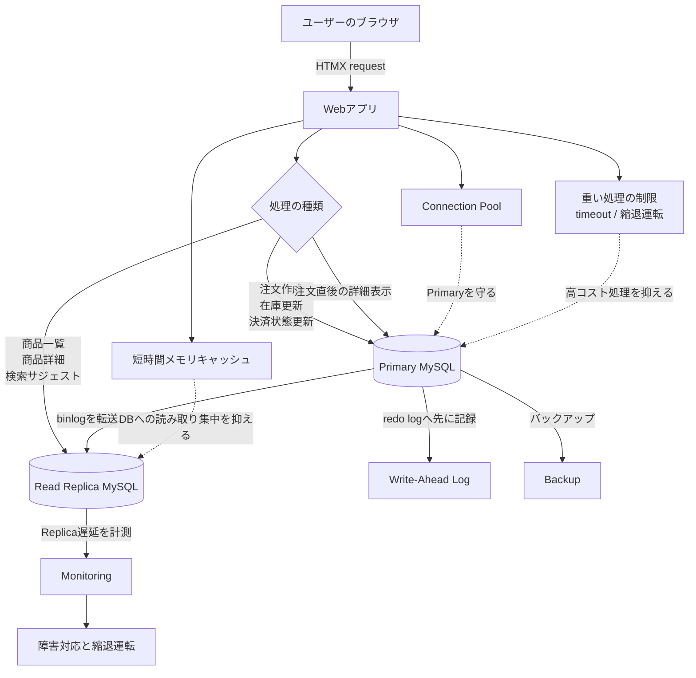

## 1. OpenAI規模ではなく、Primaryを守る考え方を真似する

この記事で参照しているOpenAIの事例は、OpenAI公式ブログの[Scaling PostgreSQL to power 800 million ChatGPT users](https://openai.com/index/scaling-postgresql/)です。OpenAIはそこで、single-primary PostgreSQL、Read Replica、cache、PgBouncer、rate limit、workload isolation、sharded systemsを組み合わせていることを説明しています。

OpenAIが公開したPostgreSQLスケーリング事例では、single-primary PostgreSQLを中核にしながら、Read Replica、cache、connection pooling、rate limit、workload isolation、sharded systemsを組み合わせて大規模な負荷をさばいています。

ただし、この記事はOpenAIの構成をそのまま再現するものではありません。中小規模のWebサイトで同じ構成を最初から目指すと、運用対象だけが増えてしまいます。
この記事で真似したいのは、OpenAIのような超大規模への対応方式ではなく、Primaryを守るという考え方そのものです。

Primaryを守るとは、負荷が増えたらPrimary DBを使わない構成へ移る、という意味ではありません。既存のPrimaryを中核に置いたまま、運用対象を増やしすぎず、Primaryへ届くread、write、connection、queryを制御することです。たとえば、ECサイトを例にして考えてみると、注文作成、在庫更新、決済状態更新、権限確認のように、正しさが重要な処理はPrimaryへ集約します。一方で、商品一覧、商品詳細、検索サジェスト、管理画面レポートのように、多少古いreadを許容できる処理はReplicaへ逃がす、といった方針のことです。

さらに、cache miss、重いSQL、接続数の急増、retry stormのように、Primaryへ負荷が集中する原因をアプリケーション側で抑えます。

今回はスタートアップなどでよくある構成としてMySQLとGolangの組み合わせを例にしています。とはいえ、考え方自体はPostgreSQLや他の言語でも十分に役立ちます。以下の説明は具体性を担保するために特定技術要素を使っていますが、本記事では「考え方」自体をお伝えできれば、というのが筆者の想いです。

| 観点 | OpenAIの事例 | 中小規模のWebサイトで真似すること |
|---|---|---|
| 中核DB | single-primary PostgreSQL | (たとえばMySQLの)Primaryを中心にする |
| 読み取り | Read Replicaへ分散 | 古いreadを許容できる画面をReplicaへ逃がす |
| 書き込み | Primaryに集約しつつ、write-heavyな処理は別システムへ移す | 注文、在庫、決済状態はPrimaryに残す |
| 接続管理 | PgBouncerなどで接続を制御 | まずGoのconnection pool設定から始める |
| キャッシュ | caching layerとcache lockingでDBを守る | まずMySQL最適化と短TTLのアプリ内cacheから始める |
| 高コスト処理 | workload isolationやrate limitで隔離する | 管理画面レポートや重い集計をReplicaや集計テーブルへ逃がす |
| 真似しないこと | 巨大規模の周辺システムをすべて導入する | 必要になるまでRedis、専用proxy、shardingを急がない |

:::message alert
筆者は「OpenAIは単一RDBだけで全世界のユーザーをさばいている」という理解はしていません。OpenAIでは、single-primary PostgreSQLを中核にしつつ、Read Replica、cache、connection pooling、rate limit、workload isolation、sharded systemsを組み合わせる設計を採用しています。
この記事で真似するのは、その構成そのものではなく、Primaryを守るための判断軸です。
:::

以降では、この考え方をMySQL、Go、HTMXで運用する中小規模のWebサイトへ落とし込みます。

## 2. 前提と用語

本記事では、数名のバックエンドエンジニアで運用する中小規模のWebサイトを題材にします。具体例として、商品閲覧、注文、在庫、管理画面レポートを持つECサイトを扱います。
OpenAIのような巨大規模なサイトではありません。目的は、OpenAIのPostgreSQLスケーリング事例から「Primaryを守る」という判断軸を取り出し、自分たちの業務規模で扱えるMySQL構成に落とし込むことです。

扱うドメインは、商品閲覧、検索サジェスト、カート、注文作成、注文詳細、管理画面の売上レポートです。フロントエンドは複雑なSPAにせず、HTMXで必要なHTML断片だけを更新します。バックエンドはGo標準ライブラリを中心に実装し、データベースはMySQLを使います。

この構成は、チームがGoとSQLに慣れており、フレームワークや外部ミドルウェアを増やしすぎずに運用したい場合に現実的です。最初は1台のMySQLでも十分に動きます。商品数や注文数が少ない間は、インデックス設計とクエリ改善だけで問題なく運用できます。

ただし、最初から想定しておきたい負荷の性質があります。アクセスが増えると、商品一覧、商品詳細、検索サジェスト、管理画面レポートのようなread処理が、注文作成や在庫更新のwrite処理と同じDBリソースを奪い合うようになります。特に管理画面の集計SQLが重くなると、ユーザー向けの注文処理まで遅くなることがあります。これは負荷が顕在化してから慌てて対応するものではなく、設計初期から「この処理はどちらのDBへ寄せられるか」を決めておくべき観点です。

そのために用意しておきたいのが、読み取りと書き込みを分ける設計です。Read Replicaを物理的に追加するかは規模によりますが、アプリケーション側のDBルーティング (Reader/Writerの分離、read-after-writeの扱い、縮退運転) は1台構成のうちから入れておけます。後からReplicaを足すときの手戻りが小さくなります。

ただし、Read Replicaを追加すれば終わりではありません。Replica遅延により、注文直後の注文詳細が見えない、更新した在庫が古く見える、管理画面の数字が一時的にずれる、といった問題が起きます。そのため、Read Replicaは性能改善のためだけでなく、Primaryを守るための構成要素として扱います。読み取り整合性、障害時の縮退運転、運用監視、そして平時の備え (閾値・定期点検・訓練・キャパシティ計画) まで含めて設計する必要があります。本記事では、書き込みはPrimary DBへ送り、読み取りの多くをReplicaに受け持たせる構成を、実務でそのまま設計判断に使える粒度で整理します。

まず全体像を置きます。この記事では、HTMXのリクエストを受けるWebアプリが、処理の性質に応じてPrimary DBとRead Replicaを使い分ける構成を前提にします。



:::details 用語集 (必要なときに開いてください)

| 用語 | 説明 |
|---|---|
| Primaryを守る | 既存のPrimaryを中核に置いたまま、運用対象を増やしすぎず、書き込みと強い整合性が必要な読み取りに集中させる設計方針です。古いreadを許容できる処理や重い処理はReplica、cache、集計テーブルなどへ逃がします |
| Primary DB | INSERT、UPDATE、DELETEを受け付けるMySQLです。つまり、書き込みを受け付けるプライマリDBです |
| Read Replica | Primary DBの変更を受け取り、主にSELECTを処理するMySQLです |
| レプリケーション | Primary DBの変更をReplicaへコピーする仕組みです |
| binlog | MySQLの変更履歴です。レプリケーションではこのログがReplicaへ送られます |
| redo log | InnoDBがクラッシュ復旧に使うログです。コミット済みデータを復旧できるようにします |
| ライトアヘッドログ | データ本体を書き換える前に変更内容をログへ記録する考え方です。MySQLでは主にInnoDBのredo logで意識します |
| HTMX | HTMLに属性を追加して、画面の一部だけをHTTPで更新するためのライブラリです |
| read-after-write | 自分が書き込んだ直後のデータを、次の読み取りですぐ確認できる性質です |
| p95 | 100回のリクエストのうち、遅いほうから5番目程度の応答時間です。平均よりも体感の遅さを見つけやすい指標です |
| outbox | DBに保存したイベントをあとでワーカーが処理するためのテーブルです。書き込みと非同期処理の橋渡しに使います |
:::

## 3. Primaryを守るための全体構成

:::message
この章では、Primaryを守るために、どの処理をPrimaryへ残し、どの処理をReplicaへ逃がすかを整理します。読み書き分離では、すべてのSELECTをReplicaへ送るのではなく、画面ごとに古い読み取りを許容できるかを判断します。
:::

今回の構成では、1つのアプリケーションがMySQLのPrimaryとReplicaへ接続する形にします。WebアプリはHTMXのリクエストを受け、HTML断片を返します。

OpenAIの事例からそのまま構成を真似するのではなく、判断軸だけを小さく取り入れます。

| 処理の性質 | OpenAI規模での考え方 | 中小規模のWebサイトでの判断 |
|---|---|---|
| read-heavyな処理 | Replica、cache、rate limitでPrimaryを守る | 商品閲覧、検索サジェスト、管理画面一覧はReplicaへ寄せる |
| write-heavyな処理 | single-primaryの限界を避けるため、分けやすい処理はsharded systemsへ移す | 注文、在庫、決済はPrimaryに残し、ログや通知はoutboxへ逃がす |
| read-after-writeが必要な処理 | Primary readが残る | 注文直後の詳細表示はPrimaryを読む |
| 高コストな処理 | workload isolationで重要処理から分離する | 管理画面レポートはReplicaまたは集計テーブルへ逃がす |
| 接続数の急増 | connection poolingでDBを守る | Goの`database/sql`で接続数を制御する |

writeは必ずPrimaryへ送ります。注文作成、在庫引当、ユーザー情報更新、決済状態更新が該当します。readは原則としてReplicaへ送ります。商品一覧、商品詳細、検索サジェスト、ランキング、管理画面の一覧が該当します。

一方で、注文直後の注文詳細はPrimaryを読みます。理由は、Replicaが数百ミリ秒から数秒遅れる可能性があるためです。ユーザーが注文完了ボタンを押した直後に「注文が見つかりません」と表示されると、システムとしては正しくても体験としては不自然です。

Primaryを守るとは、Primaryに何もさせないことではありません。既存のPrimaryを今までどおり中核として維持しながら、Primaryに残すべき処理と、逃がせる処理を分けることです。

設計判断に迷ったら、次のように分けると実務では扱いやすいです。

| 画面または処理 | 接続先 | 理由 | Primaryを守る観点 |
|---|---|---|---|
| 商品一覧 | Replica | 数秒古くても問題になりにくいです | Primaryのread負荷を逃がします |
| 商品詳細 | Replica | 商品情報は更新頻度が低いことが多いです | 同じ商品への繰り返しreadをPrimaryへ当てません |
| 検索サジェスト | Replica | 完全な即時性より応答速度を優先します | 高頻度な軽いreadをPrimaryから逃がします |
| 注文作成 | Primary | write処理です | Primaryに残すべき処理です |
| 注文直後の詳細 | Primary | 自分の書き込みをすぐ読む必要があります | read-after-writeを守るためPrimaryを読みます |
| 管理画面レポート | Replica | 重い集計をReplicaに受け持たせます | 高コストSQLでPrimaryを詰まらせないようにします |
| 在庫確保 | Primary | 古い在庫数で判断すると過剰販売が起きます | 正しさを優先してPrimaryに残します |

レプリケーション方式は、多くのWebアプリでは非同期レプリケーションから始めるのが現実的です。Primaryの書き込み応答をReplicaの状態に引きずられにくくできるため、Primaryを守る設計と相性がよいからです。ただし、Replica遅延を前提にして、画面ごとに古い読み取りを許容するかを決める必要があります。

同期レプリケーションは一貫性を強められますが、Replicaの応答を待つため書き込みが遅くなります。注文処理のように書き込みの体験が重要なアプリでは、安易に同期へ寄せるより、非同期を使いながら重要な読み取りだけPrimaryへ寄せるほうが扱いやすいです。

## 4. アプリ側で読み取りと書き込みを分ける

Goの`net/http`はリクエストごとに並行処理します。つまり、マルチスレッドに近い前提で設計する必要があります。

OpenAI規模の構成では、connection pooling、routing、rate limitなどでPrimaryを守ります。中小規模のWebサイトでは、まずアプリケーションの中でDB接続先の判断を閉じ込めます。

| 設計判断 | OpenAI事例からの学び | 本記事での実装 |
|---|---|---|
| DB接続先の制御 | Primaryへ到達するread/writeを減らす | `DBRouter`でReader/Writerを分ける |
| すべてのSELECTをReplicaへ送らない | Primary readが必要な処理は残る | `forcePrimary(ctx)`でrequest単位に制御する |
| 接続数を増やしすぎない | connection poolingでDB接続を守る | `database/sql`のconnection poolを明示的に設定する |
| 障害時に切り替える | workloadごとに優先度を分ける | Replica障害時は重要readだけPrimaryへ寄せる |
| テスト対象 | DBそのものよりrouting判断が重要 | 商品一覧、注文直後、Replica障害時のroutingをテストする |

業務では、共有変数で現在のDB接続先を場当たり的に切り替えると、別ユーザーのリクエストにも影響します。接続先の判断はリクエスト単位に閉じ込めます。

ここで、Primaryを守る判断をHTTPハンドラーに散らさないためにSOLID設計原則を採用します。業務では、商品一覧はReplica、注文作成はPrimary、注文直後の注文詳細もPrimaryという判断が増えてしまいます。これをHTTPハンドラーへ散らすと、障害時の切り替えやテストが難しくなります。RepositoryやDBルーターへ責務を分けると、Replica障害時の切り替え、read-after-write、重い処理の制限を局所的に扱えます。

リポジトリは、読み取り用と書き込み用の接続を受け取ります。ハンドラーでは、どちらのDBへ行くかを細かく知りすぎないようにします。

```go
type DBRouter struct {
    primary *sql.DB
    replica *sql.DB
}

func (r *DBRouter) Writer(ctx context.Context) *sql.DB {
    return r.primary
}

func (r *DBRouter) Reader(ctx context.Context) *sql.DB {
    if forcePrimary(ctx) {
        return r.primary
    }
    return r.replica
}
```

OpenAI事例ではPgBouncerのようなconnection poolerでDB接続を守っています。中小規模のWebサイトでは、まずGoの`database/sql`が持つconnection poolを明示的に設定します。
接続数を無制限に増やすと、クエリそのものより先にDBの接続管理が詰まります。アプリケーション台数が増えたときにも、1プロセスあたりの最大接続数を決めておくことが重要です。

```go
func configureDB(db *sql.DB) {
    db.SetMaxOpenConns(50)
    db.SetMaxIdleConns(25)
    db.SetConnMaxLifetime(30 * time.Minute)
    db.SetConnMaxIdleTime(5 * time.Minute)
}
```

`forcePrimary`は、リクエスト単位で「今回はReplicaではなくPrimaryを読む」と判断するための関数です。注文直後の画面や、Replica遅延が大きいときの重要な読み取りでtrueを返すようにします。

注文作成後の画面では、contextに「このリクエストはPrimaryを読む」という情報を入れます。ここでは注文直後のread-after-writeを表すために`withReadAfterWrite`という名前にします。

```go
func createOrderHandler(repo *OrderRepository) http.HandlerFunc {
    return func(w http.ResponseWriter, r *http.Request) {
        ctx := r.Context()

        orderID, err := repo.CreateOrder(ctx, currentUserID(r))
        if err != nil {
            http.Error(w, "注文に失敗しました", http.StatusInternalServerError)
            return
        }

        ctx = withReadAfterWrite(ctx)
        order, err := repo.FindOrder(ctx, orderID)
        if err != nil {
            http.Error(w, "注文の取得に失敗しました", http.StatusInternalServerError)
            return
        }

        renderOrderComplete(w, order)
    }
}
```

不変性は、DBルーティングの設定に効きます。起動時に作った`DBRouter`をリクエスト中に書き換えない設計にしておくと、並行実行での事故が減ります。Replica障害時の状態だけは共有されるため、`atomic.Bool`や`sync.RWMutex`で明示的に扱います。

この章で重要なのは、設計パターンの名前そのものではなく、Primaryを守る判断を局所化することです。

- DB接続の生成は、Primary用とReplica用の`*sql.DB`を起動時に作る処理へ閉じ込めます。
- Repositoryには、メトリクス計測、遅延ログ、簡単なリトライを薄く足せるようにします。
- DBコネクションプールは`main`で生成して依存性注入します。グローバル変数から直接参照するとテストが難しくなります。
- DBルーティング結果やReplica遅延は、ログやメトリクスへ流します。

テストでは、DBそのものよりルーティング判断を先に確認します。たとえば、商品一覧はReplicaを読む、注文作成はPrimaryへ書く、注文作成直後の詳細はPrimaryを読む、Replica障害時は一時的に重要readだけPrimaryへ寄せる、というテストです。ここをテストしておくと、障害対応の修正でユーザー体験を壊しにくくなります。

## 5. キャッシュを足す前にMySQLで支える

Read Replicaを入れる話をすると、同時にRedisやMemcachedを入れたくなることがあります。しかし、多くの業務アプリでは、かなり大きくなるまではMySQLとアプリ側の軽いメモリキャッシュだけで十分に耐えられます。

:::message
早すぎる最適化で発生する問題は、性能問題を解決する前に運用対象を増やしてしまうことです。将来でもRedisやMemcachedを一切使わないという意味ではありません。まずはスロークエリ、実行計画、InnoDB Buffer Pool、Replica遅延、p95レイテンシを見て、MySQL側で解ける問題かどうかを確認します。
キャッシュの目的は、単に速くすることだけではありません。同じ読み取りやcache missがDBへ一斉に流れ込まないようにし、PrimaryとReplicaの余力を守ることです。そのうえで、外部キャッシュが必要な理由をチーム内で説明できる状態にしてから導入します。
:::

| 観点 | OpenAI規模 | 中小規模のWebサイト |
|---|---|---|
| cacheの役割 | PostgreSQLへのread pressureを下げる | カテゴリ、配送方法、表示設定などを短時間cacheする |
| cacheの危険 | cache miss stormでDBが過負荷になる | TTL切れが同時発生するとDBへreadが集中する |
| 対策 | cache locking / leasing | mutexやsingleflightで同一keyの再取得を1回に抑える |
| 外部cache | 大規模負荷では重要な構成要素 | 最初からRedis/Memcachedを前提にしない |
| まず見るもの | query cost、DB CPU、replica lag | slow query、EXPLAIN、Buffer Pool、p95 |

外部キャッシュは便利ですが、運用対象が1つ増えます。キャッシュの期限切れ、削除漏れ、フェイルオーバー、メモリ逼迫、ネットワーク障害も扱う必要があります。最初から入れると、DBのクエリ設計が悪いだけなのか、キャッシュ戦略が悪いのかを切り分けにくくなります。

まず見るべき具体策は、次の順番です。上から順に確認すると、外部キャッシュなしで改善できる余地を見つけやすくなります。

| 対策 | 具体例 | 使う場面 |
|---|---|---|
| 適切なインデックス | `products(status, updated_at, id)` | 商品一覧や管理画面一覧を速くします |
| クエリ削減 | N+1をJOINやIN句へ寄せます | 一覧画面のDB往復を減らします |
| InnoDB Buffer Pool | よく読むテーブルとインデックスをメモリへ載せます | 読み取りが多いアプリの基礎体力を上げます |
| Read Replica | 商品閲覧やレポートを分散します | Primaryの書き込み余力を守ります |
| アプリ内メモリキャッシュ | カテゴリ一覧や設定値を短時間だけ持ちます | 更新頻度が低く、多少古くてもよい値に使います |
| MySQL集計テーブル | 日次売上や商品ランキングを事前計算します | 毎回重い集計を走らせないために使います |

たとえば、商品カテゴリが200件程度で、更新が1日に数回しかない場合は、Redisへ置く前にGoプロセス内のメモリキャッシュで十分です。

```go
type CategoryCache struct {
    mu        sync.RWMutex
    items     []Category
    expiresAt time.Time
}

func (c *CategoryCache) Get(ctx context.Context, repo *CategoryRepository) ([]Category, error) {
    now := time.Now()

    c.mu.RLock()
    if now.Before(c.expiresAt) {
        items := append([]Category(nil), c.items...)
        c.mu.RUnlock()
        return items, nil
    }
    c.mu.RUnlock()

    c.mu.Lock()
    defer c.mu.Unlock()

    if now.Before(c.expiresAt) {
        return append([]Category(nil), c.items...), nil
    }

    items, err := repo.FindAll(ctx)
    if err != nil {
        return nil, err
    }

    c.items = append([]Category(nil), items...)
    c.expiresAt = now.Add(30 * time.Second)
    return items, nil
}
```

この実装では、期限切れ時に`mu.Lock()`で再取得を1回に寄せています。これは大規模システムでいうcache lockingに近い考え方です。
同じカテゴリ一覧のcacheが切れた瞬間に、すべてのリクエストがDBへ向かうと、キャッシュがあるのにDB負荷が跳ね上がります。このような状態はcache stampedeと呼ばれます。外部キャッシュを入れる場合でも、cache miss時にDBへ同じ問い合わせが集中しないようにする必要があります。

ここでコピーして返しているのは、呼び出し側がキャッシュ内部のスライスを変更しないようにするためです。これも不変性の実務的な使い方です。

この方式は、次のようなデータに向いています。

- 商品カテゴリ
- 都道府県や配送方法
- 画面表示用の設定値
- 公開中キャンペーンの一覧
- フッターに出すリンク一覧

一方で、在庫数、注文状態、決済状態、ユーザーの権限はアプリ内メモリキャッシュに向きません。古い値で判断すると、在庫引き当て間違いや権限漏れにつながります。

MySQL自体にも、キャッシュに近い役割があります。特にInnoDB Buffer Poolは重要です。よく使うデータページとインデックスページがメモリに載るため、同じクエリを繰り返す商品一覧や商品詳細はかなり速くなります。

:::message
InnoDB Buffer Poolの基本や、N+1問題を解消したときの効果は、別記事の[MySQL + GoでN+1問題を32倍高速化した話とInnoDB Buffer Poolの活用](https://zenn.dev/okamyuji/articles/mysql-n-plus-1)で詳しく扱っています。この記事では、外部キャッシュを足す前にMySQL側で確認すべき代表例として位置づけます。
:::

実務では、まず次の状態を確認します。

```sql
SHOW GLOBAL STATUS LIKE 'Innodb_buffer_pool_read%';
SHOW GLOBAL STATUS LIKE 'Threads_connected';
SHOW GLOBAL STATUS LIKE 'Queries';
```

ディスク読み取りが多すぎる場合は、Buffer Poolが小さい、インデックスが効いていない、クエリが広すぎる可能性があります。Redisを入れる前に、`EXPLAIN ANALYZE`で実行計画を確認し、インデックスで必要な行だけ読めているかを見ます。

管理画面の売上レポートは、毎回注文テーブルを全期間集計しないほうがよいです。MySQL内に日次集計テーブルを作り、注文確定時またはバッチで更新します。

```sql
CREATE TABLE daily_sales_summary (
    sales_date DATE NOT NULL,
    total_orders INT NOT NULL,
    total_amount DECIMAL(12, 2) NOT NULL,
    updated_at DATETIME NOT NULL,
    PRIMARY KEY (sales_date)
);
```

これなら、管理画面は巨大な注文テーブルではなく、小さな集計テーブルを読みます。Read Replicaから読むようにすれば、Primaryへの影響も抑えられます。

RedisやMemcachedを入れる判断は、次の条件が揃ってからで十分です。外部キャッシュを入れる目的は、単に応答を速くすることではなく、DBへ到達するread pressureを制御することです。

- MySQLのインデックスとクエリを直してもp95が目標に届かない。
- Read Replicaを使っても読み取り負荷が高止まりしている。
- アプリ内メモリキャッシュが複数台アプリ間での整合性で問題になる。
- キャッシュ削除やTTLの運用をチームで扱える。
- cache miss時に同じ問い合わせがDBへ集中しない仕組みを用意できる。
- キャッシュが落ちたときに、PrimaryやReplicaを巻き込まないrate limitや縮退運転がある。

これらの条件は、実際に困ってから確認するのでは判断が遅れます。p95やReplica遅延、Buffer Poolヒット率の閾値をSLOとして先に決めておき、閾値に近づいた段階で検討を始める運用にすると、本番影響が出る前に動けます。閾値の置き方と定期点検のリズムは次章で扱います。

大事なことは、キャッシュを入れないことではありません。入れる前に、MySQLでできることを使い切り、キャッシュが必要な理由を説明できる状態にすることです。

## 6. プロアクティブ運用設計 — 障害が起きる前に決めておくこと

:::message
この章では、障害が起きてからアーキテクチャを検討するのではなく、平時から備えておく観点を整理します。過剰な仕組みを最初から積み上げてしまうのではなく、「閾値」「定期点検」「訓練」「キャパシティ計画」という、低コストで戻しやすい備えだけを先に持っておく、という考え方です。
:::

Primaryを守る設計は、負荷が顕在化したときに考え始めるものではありません。OpenAI事例のような大規模構成を急いで真似する必要はありませんが、平時の備えだけは小さなうちから持っておくと、負荷が増えたときに落ち着いて対応できます。

ここで言う備えは、追加のミドルウェアや専用基盤ではありません。次の4つを決めておくだけで十分です。

| 備え | 内容 | 早く始めるほど効くこと |
|---|---|---|
| 閾値とSLOの事前定義 | p95、Replica遅延、Buffer Poolヒット率、エラー率の目標値を先に決める | 障害発生前に検討を開始できる |
| 定期点検のリズム | スロークエリ、実行計画、メトリクス推移を月次から四半期でレビューする | 兆候を早く拾える |
| 障害訓練 | Replica停止、Primary切り替え、cache miss集中を計画的に試す | 本番障害時に手順書が机上で終わらない |
| キャパシティ計画 | 注文数、ユーザー数、画面アクセスの想定をビジネス側と共有する | キャンペーン直前に慌てない |

### 6.1 閾値とSLOを先に決める

「p95が目標に届かなくなってから外部キャッシュを検討する」だけでは判断が遅れがちです。p95、Replica遅延、Buffer Poolヒット率、エラー率の目標値を先に決め、閾値を超える前に検討に入る運用にしておきます。

| 指標 | 例として置きやすい閾値 | 超えたときの初動 |
|---|---|---|
| 注文系のp95 | 500ms | スロークエリ確認とインデックス見直し |
| Replica遅延 | 1秒 | 重い管理画面SQLの分離、集計テーブル化 |
| Buffer Poolヒット率 | 99% | Buffer Poolサイズ見直し、不要readの削減 |
| DB接続エラー率 | 0.1% | connection poolとアプリ側のretry設定見直し |

数値は事業特性で変わります。重要なのは、チーム内で先に合意しておき、超える前に検討を始めることです。閾値の8割に到達した時点で「次の手」を決め始めると、本番影響が出る前に動けます。

### 6.2 定期点検のリズムを決める

スロークエリログ、EXPLAIN、Buffer Poolの状況、Replica遅延の推移は、障害時にだけ見るものではありません。平時から月次から四半期でレビューしておくと、ゆっくり悪化するクエリや、データ量増加で効かなくなったインデックスに気づけます。

業務では、次のような点検リズムが扱いやすいです。

- 毎週: スロークエリTop10、エラー率、p95の推移
- 月次: インデックスの効きとデータ量の変化、Buffer Poolヒット率
- 四半期: アクセス傾向の変化、Replica構成と用途の見直し
- リリース前: 新機能のクエリプラン、想定流入による負荷見積もり

これらは専用ツールを増やさなくても、既存のメトリクス基盤と`SHOW`系SQL、`EXPLAIN ANALYZE`で十分に始められます。

### 6.3 リリース前の負荷試験と障害訓練

新機能のリリース前に、想定流入での負荷試験を1回だけでも行うと、本番に近い形でクエリプランや接続数の挙動を確認できます。大規模なツールは不要で、`vegeta`や`k6`で主要画面と注文系APIだけを叩く小さな試験で十分なことが多いです。

加えて、Replica停止やPrimary切り替えの訓練を半年から1年に1回、計画的に行います。手順書を持っているだけでは、いざというときに動けません。ステージング環境でReplicaを止めて、次章で扱う縮退運転が想定通り発動するかを試しておくだけでも、本番障害時の動きが変わります。

### 6.4 ビジネス側とキャパシティ計画を共有する

キャンペーン、テレビ露出、法人顧客の利用開始、SNS拡散は、技術側だけでは予測できません。事業計画やマーケティング施策と、注文数や画面アクセスの想定をビジネス側と共有しておくと、ピーク前にReplica追加や集計テーブル化の判断ができます。

「キャンペーンの2週間前までに、想定流入を共有してもらう」というルールを1つ持つだけでも、当日に慌ててPrimaryへ読み取りを寄せて連鎖障害を起こす、といった事故を防げます。

この章で扱った備えは、どれも追加ミドルウェアを必要としません。Primaryを守る設計の延長線上にある運用上の判断軸です。次章では、これらの備えがあっても発生する障害について、Replica遅延、ライトアヘッド、縮退運転の観点から扱います。

## 7. Replica遅延、ライトアヘッド、障害時の縮退運転と回復

:::message
この章では、Primaryを守りながら、書き込み成功、MySQL内部での永続化、Replicaへの反映、障害時の回復を分けて見ます。前章で扱った平時の備えがあっても障害は発生します。ここを分けて考えると、注文は作成されたのにReplicaではまだ見えない、という状況を落ち着いて調査できます。
:::

| 障害・遅延 | OpenAI規模での考え方 | 中小規模のWebサイトでの対応 |
|---|---|---|
| Replica lag | Read Replicaの増やし方によっては、WAL転送がPrimary側の制約になる | lagが閾値を超えたら重要readをPrimaryへ寄せる |
| Primary障害 | HA構成とhot standbyで復旧する | Replica昇格手順とsplit brain対策を決める |
| Replica障害 | 複数Replicaとworkload isolationで影響を抑える | 管理画面レポートや検索サジェストを止める |
| 高コストquery | rate limitやquery blockで守る | 管理画面SQLにtimeoutを設定し、集計テーブルへ逃がす |
| schema change | 軽量DDLに限定し、backfillにrate limitをかける | migrationを小さく分け、長時間lockを避ける |

ライトアヘッドログは、障害時にデータを復旧するための重要な考え方です。MySQLのInnoDBでは、データページへ反映する前にredo logへ変更内容を書きます。これにより、サーバーが落ちてもコミット済みの変更を復旧できます。

アプリケーションがredo logを直接操作するわけではありません。ただし、障害調査では「アプリの書き込み成功」「MySQL内部での永続化」「Replicaへの反映」が別の段階であることを理解しておく必要があります。この区別がないと、注文は作成されたのにReplicaでは見えない、という状況をバグとして誤認しやすくなります。

レプリケーションではbinlogも重要です。Primaryで発生した変更がbinlogに記録され、Replicaがそれを取り込んで反映します。つまり、アプリ側から見ると「書き込みは成功したが、Replicaにはまだ届いていない」という時間が発生します。

HTMXの画面では、この遅延が見えやすいです。ボタン押下後にHTML断片を差し替えるため、直後に古いReplicaを読むと違和感が出ます。

たとえば、カートから注文を確定する画面では、次のように設計します。

1. `POST /orders`はPrimaryへ書き込みます。
2. 注文完了HTMLを返すための注文詳細はPrimaryから読みます。
3. その後の注文履歴一覧は、数秒以内ならPrimaryを読みます。
4. 一定時間が過ぎたら、注文履歴一覧はReplicaへ戻します。

この「一定時間」は、Replica遅延の通常値から決めます。重要なのは、すべての読み取りをPrimaryへ戻すのではなく、自分の書き込み直後のように整合性が必要な読み取りだけを短時間Primaryへ寄せることです。普段の遅延が100ミリ秒以下なら、3秒から5秒程度のread-after-write windowを持たせるだけで十分なことがあります。

```go
func withReadAfterWrite(ctx context.Context) context.Context {
    return context.WithValue(ctx, readAfterWriteUntilKey{}, time.Now().Add(5*time.Second))
}

func forcePrimary(ctx context.Context) bool {
    until, ok := ctx.Value(readAfterWriteUntilKey{}).(time.Time)
    return ok && time.Now().Before(until)
}
```

ストリーミングやメッセージングは、注文完了メール、検索インデックス更新、外部通知のような後続処理に使います。業務では、ユーザーへすぐ返す必要がある処理と、あとで実行してよい処理を分けるために適用します。ただし、今回の主役はMySQLです。最初はMySQL内のoutboxテーブルへイベントを書き、Goのワーカーが定期的に処理するだけでも十分です。

```sql
CREATE TABLE outbox_events (
    id BIGINT NOT NULL AUTO_INCREMENT,
    event_type VARCHAR(100) NOT NULL,
    payload JSON NOT NULL,
    processed_at DATETIME NULL,
    created_at DATETIME NOT NULL,
    PRIMARY KEY (id),
    KEY idx_outbox_events_unprocessed (processed_at, id)
);
```

注文作成とoutbox登録を同じトランザクションで行えば、「注文は作られたがメールイベントは失われた」という事故を減らせます。外部のメッセージブローカーは、処理量やサービス分割が本当に必要になってからでも遅くありません。

### 障害時に何を見てどう回復するか

レプリケーション構成で最初に見るべきものは、Replica遅延です。

```sql
SHOW REPLICA STATUS\G
```

特に確認する項目は、SQLスレッドが動いているか、IOスレッドが動いているか、遅延秒数が増え続けていないかです。遅延が増えている場合、重いSELECTがReplicaを詰まらせている、ネットワークが遅い、Primaryの書き込み量が多すぎる、Replicaのスペックが足りない、といった原因を疑います。

MySQL 8系では、まず次の項目を確認します。

| 項目 | 見ること |
|---|---|
| `Replica_IO_Running` | Primaryからbinlogを受け取れているかを見ます |
| `Replica_SQL_Running` | 受け取った変更をReplicaで適用できているかを見ます |
| `Seconds_Behind_Source` | ReplicaがPrimaryからどれくらい遅れているかを見ます |

アプリ側では、次のメトリクスを最低限見ます。

| メトリクス | 見る理由 |
|---|---|
| Primaryの書き込みp95 | 注文作成や更新処理の体験を守るためです |
| Replicaの読み取りp95 | 商品閲覧や管理画面の遅さを検知するためです |
| Replica遅延秒数 | 古い読み取りの影響を判断するためです |
| DB接続エラー率 | 障害の初動を検知するためです |
| コネクション数 | アプリ増加や接続漏れを見つけるためです |
| バックアップ時間 | メンテナンス負荷を把握するためです |
| cache hit率 | cache missがDBへ集中していないかを見るためです |
| 重いSQLのtimeout件数 | 高コストqueryからPrimaryやReplicaを守れているかを見るためです |
| read-after-writeでPrimaryへ寄せた回数 | Primary readが増えすぎていないかを見るためです |

重い管理画面SQLには、通常ユーザー向け処理より短いtimeoutを設定します。OpenAI規模ではrate limitやquery単位の遮断で高コストqueryからDBを守ります。中小規模のWebサイトでは、まずcontext timeoutで重い処理を止めるだけでも効果があります。

```go
func reportHandler(repo *ReportRepository) http.HandlerFunc {
    return func(w http.ResponseWriter, r *http.Request) {
        ctx, cancel := context.WithTimeout(r.Context(), 3*time.Second)
        defer cancel()

        report, err := repo.MonthlySales(ctx)
        if err != nil {
            http.Error(w, "レポートの取得に時間がかかっています。時間をおいて再度お試しください。", http.StatusServiceUnavailable)
            return
        }

        renderReport(w, report)
    }
}
```

Replicaだけが落ちた場合は、一時的にPrimaryへ読み取りを寄せます。ただし、これはPrimaryを守る設計と矛盾しないように制御する必要があります。
すべての読み取りを無制限にPrimaryへ流すと、Replica障害がPrimary障害へ連鎖します。商品一覧などの一部画面は簡易表示にする、管理画面レポートを一時停止する、検索サジェストを返さない、といった縮退運転を用意します。

Primaryが落ちた場合は、Replicaを昇格します。ただし、Primaryを守る設計は、Primaryが1つだけ存在する前提で成り立ちます。
そのため、昇格時には古いPrimaryが書き込みを受けないように停止または隔離します。ここを曖昧にすると、古いPrimaryと新しいPrimaryの両方が書き込みを受けるsplit brainが起きます。業務では、自動フェイルオーバーを使う場合でも、書き込み先が1つだけになることを確認する仕組みが必要です。

セキュリティもこの構成では重要です。SSL/TLSは、ブラウザとGoアプリ間だけではなく、GoアプリとMySQL間にも適用します。JWTはAPIクライアントやモバイルアプリと相性がよいです。OAuthは外部ID基盤やSaaSログインと連携する場面で使います。HTMX中心の通常Web画面では、Cookieセッションのほうが自然な場合も多いです。重要なのは、認証方式よりも、管理画面や更新系エンドポイントで権限確認を必ず行うことです。

最後に、テスト観点をまとめます。

- 商品一覧はReplicaを読むことを確認します。
- 注文作成はPrimaryへ書くことを確認します。
- 注文直後の注文詳細はPrimaryを読むことを確認します。
- Replica遅延が閾値を超えたら、重要な読み取りをPrimaryへ寄せることを確認します。
- Replica障害時に、管理画面レポートを止めてPrimaryを守ることを確認します。
- アプリ内メモリキャッシュがTTL後に更新されることを確認します。
- キャッシュ対象に在庫数や権限を入れていないことを確認します。

## 8. OpenAI事例から真似すること、まだ真似しないこと

OpenAI事例から真似すべきなのは、PostgreSQLを使うことそのものではありません。single-primaryを長く使うために、Primaryへ到達するread、write、connection、query、schema changeを制御する考え方です。

中小規模のWebサイトでは、最初からOpenAIと同じ周辺システムを持つ必要はありません。むしろ、運用対象を増やしすぎると、障害原因の切り分けが難しくなります。

| 項目 | すぐ真似してよい | まだ真似しなくてよい |
|---|---|---|
| Primaryを守る | writeと重要readに集中させる | - |
| Read Replica | 読み取り負荷が明確なら導入する | 最初から多数のReplicaは不要 |
| Connection pooling | Goの`database/sql`設定から始める | 専用proxyは接続数が問題化してから |
| Cache | 更新頻度が低い値を短TTLでcacheする | 最初からRedis/Memcached前提にしない |
| Cache stampede対策 | mutexで同一keyの再取得を1回に抑える | 分散lockや高度なleasingは後でよい |
| Rate limit | 管理画面や重いAPIにはtimeoutを入れる | query digest単位の遮断は大規模化後 |
| Workload isolation | レポート系をReplicaへ分ける | 専用DB fleetまでは不要 |
| Sharding | ログやイベントなど分けやすいものから考える | 注文DBのshardingは最後 |
| Schema change制御 | migration timeoutや小分けbackfillを意識する | 専用の大規模migration基盤は後でよい |

OpenAI規模の構成をそっくりそのまま真似する必要はありません。真似すべきなのは、Primaryへ到達する負荷を制御する「考え方」です。

## 9. さらにスケールが必要になったときの進め方

Primaryを守る設計は、一度作って終わりではありません。第6章で扱った定期点検 (四半期レビュー、リリース前の負荷試験、想定流入の事前共有) を一次トリガーにし、アクセス増加、キャンペーン、テレビ露出、SNSでの拡散、法人顧客の利用開始といった事業イベントを二次トリガーとして、どの負荷をPrimaryから逃がすかを見直します。閾値の8割到達やデータ量の倍増のような、定量的な兆候を見直しのきっかけにできると、障害が起きてから慌てて構成を変える流れを避けられます。

スケールできないことが、そのまま機会損失になる場面があります。注文処理が詰まると売上だけでなく信用も失います。その場合も、いきなり大きな構成変更へ飛ばず、効果が出やすく戻しやすい順に進めます。

1. 現在のボトルネックを数値で確認します。Primaryの書き込みp95、Primaryに残っているread、Replica遅延、スロークエリ、DB CPU、Buffer Poolヒット率を見ます。
2. 重いSQLから直します。N+1、不要なJOIN、深いOFFSET、インデックス不足、全期間集計を優先して解消します。
3. 画面ごとの読み取り先を見直します。古い読み取りを許容できる画面をReplicaへ寄せ、注文直後、在庫確認、決済状態、権限確認はPrimaryに残します。
4. 集計テーブルや事前計算を増やします。売上レポート、ランキング、在庫アラートのように毎回集計しなくてよいものを軽くします。
5. アプリ内メモリキャッシュを入れます。カテゴリ、配送方法、表示設定のように更新頻度が低いデータから短いTTLで始めます。
6. Replicaを増やします。読み取り負荷が明確に高い場合は、用途別に商品閲覧用、管理画面用、バックアップ用を分けます。
7. 外部キャッシュを導入します。複数台アプリで同じキャッシュを共有する必要があり、cache miss時にDBへ負荷が集中しない設計を説明できる状態でRedisやMemcachedを使います。
8. 非同期処理を切り出します。メール送信、検索インデックス更新、外部通知、重いレポート作成をoutboxやメッセージングに移します。
9. 書き込みボトルネックを見直します。注文、在庫、決済のトランザクション範囲を短くし、ロック時間を減らします。
10. それでも足りなければ、サービス分割やシャーディングを検討します。特にログ、通知、検索インデックス更新など、Primaryのトランザクションから切り離しやすいものから分けます。注文DBのshardingは運用負荷が大きいため最後に判断します。

## 10. まとめ

OpenAIのPostgreSQL事例から学べるのは、単一RDBだけで何でも処理するという話ではありません。

重要なのは、single-primaryを中核にしながら、Primaryへ到達するread、write、connection、queryを制御することです。read-heavyな処理はReplicaやcacheへ逃がし、write-heavyで分けやすい処理は別システムへ移し、高コストqueryやcache miss stormがDB全体を巻き込まないようにします。

中小規模のWebサイトでも、この考え方はそのまま使えます。本記事のEC例であれば、注文、在庫、決済のような重要な書き込みはPrimaryへ集約し、商品閲覧や管理画面レポートはReplicaへ逃がします。注文直後の詳細表示はread-after-writeを守るためにPrimaryを読みます。

RedisやMemcached、メッセージブローカー、専用proxy、shardingは、最初から入れる必要はありません。まずはMySQLのインデックス、クエリ改善、InnoDB Buffer Pool、Read Replica、集計テーブル、Goアプリ内の短時間キャッシュで支えられます。

同時に、障害が起きてからアーキテクチャを検討するのではなく、平時の備え (閾値とSLOの事前定義、定期点検、リリース前の負荷試験と障害訓練、ビジネス側とのキャパシティ計画共有) を小さく持っておくことも、Primaryを守る設計の一部です。追加ミドルウェアを増やさなくても、これらは始められます。

設計判断に迷ったら、次の4つを確認します。

1. この処理はPrimaryを守っているか
2. 古い読み取りを許容できるか
3. DBに同じ負荷が一斉に流れ込まないか
4. 閾値や定期点検で、障害になる前に気づける状態か

OpenAI規模でなくても、RDB設計はPrimaryを守る考え方でだいたい対応できます。巨大な構成をそのまま導入するのではなく、Primaryを守る考え方を自分たちの業務規模へ翻訳すること、そしてその設計を平時から維持する備えを持つことが、運用しやすいスケール設計につながります。
